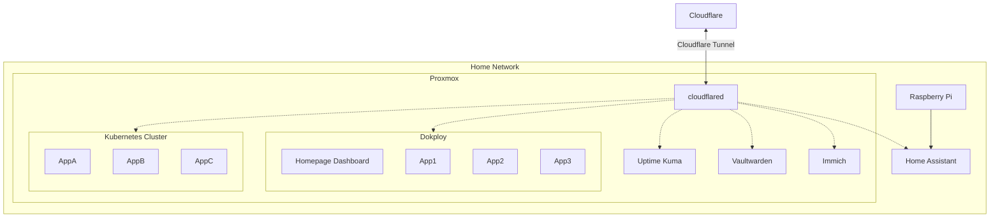

## Tunnel

https://community-scripts.org/scripts/cloudflared

## Domains

### Subdomains (A record)
Main domain is pkosmowski.pl which is registered in the Cloudflare.
Using tunnel I can register on the tunnel level subdomain.

#### Tunnel configuration

> [!IMPORTANT]
> 1) Use HTTP endpoints in the local network. Cloudflare will generate certificates for the public domain and will encrypt the traffic between Cloudflare and the local network. Using HTTPS you need to generate certificates for the local network and then Cloudflare will encrypt the traffic between Cloudflare and the local network. Using HTTPS you must generate and manintain certificates for the local network for local domain and IP and it adds the networking overhead.
> 2) For any service you must set the static IP in the local network and map it to the MAC address in the router. Then you can use the static IP or hostname in the published application route in your router.

1) Navigate to: Protect & connect -> Zero Trust -> Networks -> Tunnels & Mesh -> [Your tunnel] -> Published application routes
2) Add a published application route

Example for any IP or host in the Cloudflared client network:
- Subdomain: x 
- Domain: pkosmowski.pl
- Service Type: HTTP
- Service (Host name): http://ha.home
- Service (Host for Modem): http://192.168.0.1

### Wildcard subdomains (CNAME record)
 
Please find example configuration for *.pkosmowski.pl in the [Dokploy section](./dokploy#subdomains-cname-record-with-cloudflare-tunnel)
