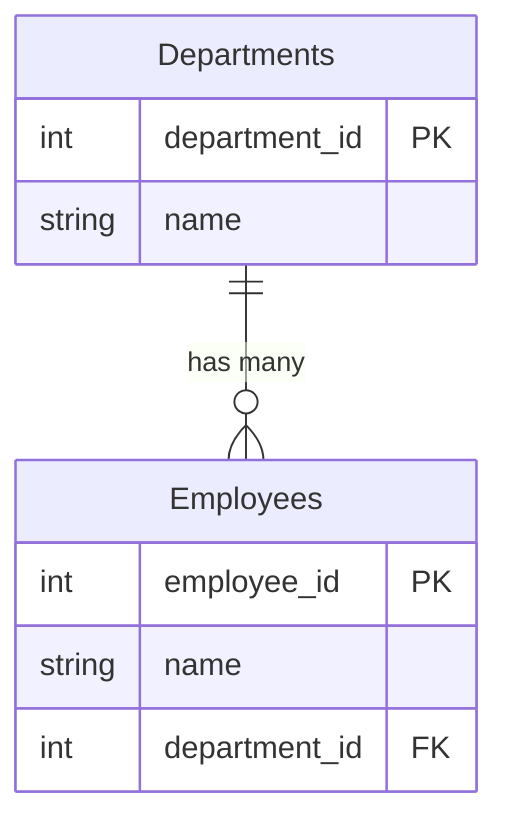
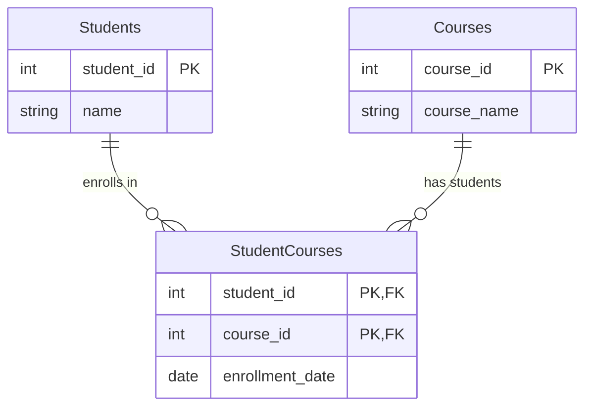

Sure! Here are examples of **One-to-One**, **One-to-Many**, and **Many-to-Many** relationships with table schemas.

- - -

### **1. One-to-One (1:1)**

A **one-to-one** relationship means each record in **Table A** corresponds to exactly one record in **Table B**.

```mermaid
erDiagram
    Users ||--o| UserProfiles : "has one"
    
    Users {
        int user_id PK
        string username
        string email
    }
    
    UserProfiles {
        int profile_id PK
        int user_id FK UNIQUE
        string first_name
        string last_name
        string bio
    }
```

Each user has exactly one profile.

```sql
CREATE TABLE Users (
    user_id SERIAL PRIMARY KEY,
    username VARCHAR(50) UNIQUE NOT NULL,
    email VARCHAR(100) UNIQUE NOT NULL
);

CREATE TABLE UserProfiles (
    profile_id SERIAL PRIMARY KEY,
    user_id INT UNIQUE NOT NULL,
    first_name VARCHAR(50),
    last_name VARCHAR(50),
    bio TEXT,
    FOREIGN KEY (user_id) REFERENCES Users(user_id) ON DELETE CASCADE
);
```

🔹 `UserProfiles.user_id` is both a **foreign key** and **unique**, ensuring a **1:1** relationship.

- - -

### **2. One-to-Many (1:M)**

A **one-to-many** relationship means each record in **Table A** can be associated with multiple records in **Table B**.



Each department has multiple employees, but each employee belongs to only one department.

```sql
CREATE TABLE Departments (
    department_id SERIAL PRIMARY KEY,
    name VARCHAR(100) NOT NULL UNIQUE
);

CREATE TABLE Employees (
    employee_id SERIAL PRIMARY KEY,
    name VARCHAR(100) NOT NULL,
    department_id INT,
    FOREIGN KEY (department_id) REFERENCES Departments(department_id) ON DELETE SET NULL
);
```

🔹 One **department** can have multiple **employees**, but each **employee** belongs to only one **department**.

- - -

### **3. Many-to-Many (M:N)**

A **many-to-many** relationship means multiple records in **Table A** can be associated with multiple records in **Table B**.



A student can enroll in multiple courses, and a course can have multiple students.

```sql
CREATE TABLE Students (
    student_id SERIAL PRIMARY KEY,
    name VARCHAR(100) NOT NULL
);

CREATE TABLE Courses (
    course_id SERIAL PRIMARY KEY,
    course_name VARCHAR(100) NOT NULL UNIQUE
);

CREATE TABLE StudentCourses (
    student_id INT,
    course_id INT,
    enrollment_date DATE DEFAULT CURRENT_DATE,
    PRIMARY KEY (student_id, course_id),
    FOREIGN KEY (student_id) REFERENCES Students(student_id) ON DELETE CASCADE,
    FOREIGN KEY (course_id) REFERENCES Courses(course_id) ON DELETE CASCADE
);
```

🔹 The **StudentCourses** table acts as a **junction table** to establish the **many-to-many** relationship.

- - -
