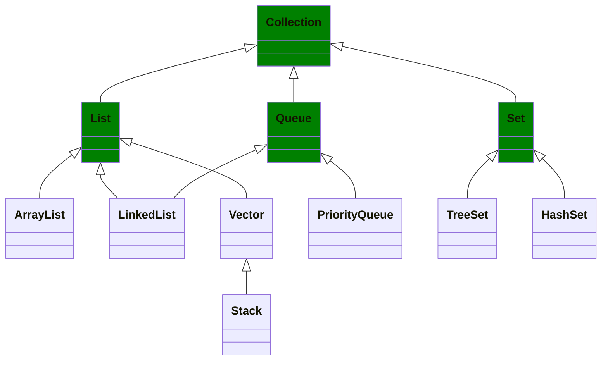
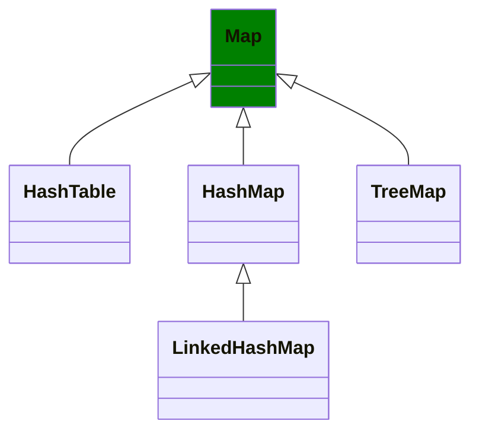

+++
title = 'Data Structures'
BookCollapseSection = true
+++

Datas structures in Java using Java Collections Framework

# Collections

```mermaid
classDiagram
    class Collection
    style Collection fill:green 

    class Set
    style Set fill:green 
    Collection  <|-- Set
    
    class List
    style List fill:green 
    Collection  <|-- List
    
    class Queue
    style Queue fill:green 
    Collection  <|-- Queue

    class ArrayList
    List  <|-- ArrayList

    class LinkedList
    List  <|-- LinkedList
    Queue  <|-- LinkedList

    class Vector
    List  <|-- Vector

    class Stack
    Vector  <|-- Stack

    class PriorityQueue
    Queue <|-- PriorityQueue

    class TreeSet
    Set <|-- TreeSet

    class HashSet
    Set <|-- HashSet
```

# Maps

```mermaid
classDiagram    
    class Map
    style Map fill:green 
    
    class HashTable
    Map <|-- HashTable

    class HashMap
    Map <|-- HashMap

    class LinkedHashMap
    HashMap <|-- LinkedHashMap

    class TreeMap
    Map <|-- TreeMap

```