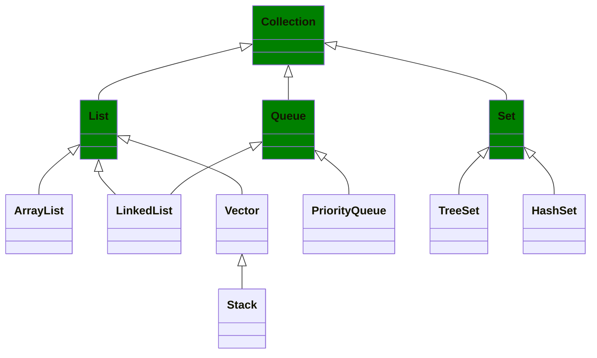
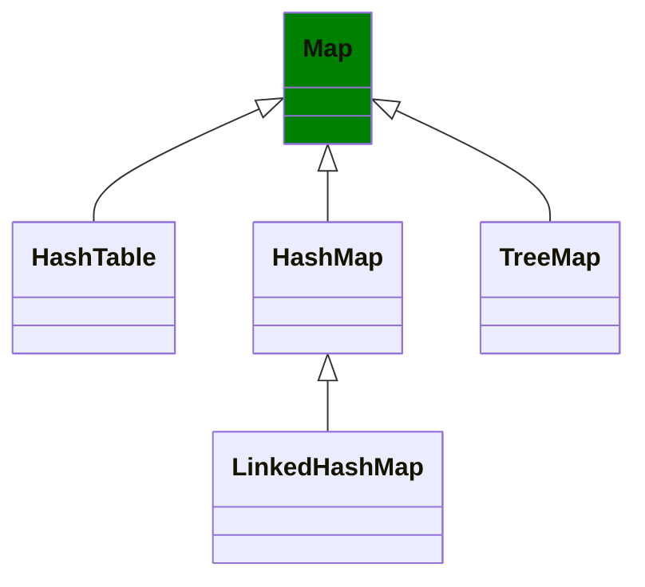

Using Java Framework

# Arrays
Fixed-size data structure to store elements of the same type in contiguous memory locations.
Arrays hold values of the same type at contiguous memory locations. In an array, we're usually concerned about two things - the position/index of an element and the element itself.

**Advantages**

- Store multiple elements of the same type with one single variable name
- Accessing elements is fast as long as you have the index, as opposed to linked lists where you have to traverse from the head.

**Disadvantages**

- Addition and removal of elements into/from the middle of an array is slow because the remaining elements need to be shifted to accommodate the new/missing element. An exception to this is if the position to be inserted/removed is at the end of the array.
- For certain languages where the array size is fixed, it cannot alter its size after initialization. If an insertion causes the total number of elements to exceed the size, a new array has to be allocated and the existing elements have to be copied over. The act of creating a new array and transferring elements over takes O(n) time.

**Time Complexity**

| Operation | Big-O | Note |
| --- | --- | --- |
| Access | O(1) |     |
| Insert | O(n) | Insertion would require shifting all the subsequent elements to the right by one and that takes O(n) |
| Insert (at the end) | O(1) | Special case of insertion where no other element needs to be shifted |
| Remove | O(n) | Removal would require shifting all the subsequent elements to the left by one and that takes O(n) |
| Remove (at the end) | O(1) | Special case of removal where no other element needs to be shifted |

Example:
```java
int[] array = new int[10];
```

**Operations**
- Searching
- Reverting
- Subarray

# Strings

# Collections



## Lists
### ArrayList
A dynamic array implementation provided in Java, which can resize itself when needed.
*   **Java Implementation:**

Example:
```java
ArrayList<Integer> list = new ArrayList<>();
```

*   **Use Cases:** Frequently used to store elements when the number of elements can change dynamically.

### LinkedList

*   **Description:** A linear data structure where elements (nodes) contain references to the next (and optionally the previous) node.
*   **Java Implementation:**

Example:
```java
LinkedList<Integer> list = new LinkedList<>();
```
*   **Use Cases:** Efficient insertions or deletions at both ends or in the middle.

### Vector
### Stack

*   **Description:** A last-in-first-out (LIFO) data structure where the most recently added element is accessed first.
*   **Java Implementation:**

Example:
```java
Stack<Integer> stack = new Stack<>();
```
*   **Use Cases:** Used in depth-first search (DFS), expression evaluation, backtracking, etc.

## Queue

## Set

# Maps




## HashMap (or Map Interface)

*   **Description:** A collection that stores key-value pairs, providing constant-time complexity for insertions, deletions, and lookups.
*   **Java Implementation:**

Example:
```java
HashMap<String, Integer> map = new HashMap<>();
```
*   **Use Cases:** Frequently used for scenarios requiring fast lookups by a key, like counting frequencies of elements or caching.

### 5.  HashSet (or Set Interface)

*   **Description:** A collection that stores unique elements with no duplicate values and provides constant-time operations.
*   **Java Implementation:**

Example:
```java
HashSet<Integer> set = new HashSet<>();
```
*   **Use Cases:** Efficient for checking the existence of an element in a collection.


### 7.  Queue

*   **Description:** A first-in-first-out (FIFO) data structure where the first element added is the first one to be removed.
*   **Java Implementation:**

Example:
```java
Queue<Integer> queue = new LinkedList<>();
```
*   **Use Cases:** Task scheduling, breadth-first search (BFS), etc.

### 8.  PriorityQueue

*   **Description:** A special type of queue where elements are dequeued in order of their priority.
*   **Java Implementation:**

Example:
```java
PriorityQueue<Integer> pq = new PriorityQueue<>();
```
*   **Use Cases:** Task scheduling with priorities, Dijkstra's algorithm, Huffman coding, etc.

### 9.  Tree (Binary Tree, Binary Search Tree)

*   **Description:** A hierarchical data structure where each node has a value and pointers to child nodes.
*   **Java Implementation:** Custom implementations for Binary Tree or Binary Search Tree.
*   **Use Cases:** Efficient searching, sorting, hierarchical data representation, etc.

### 10.  Trie

*   **Description:** A tree-like data structure used to store dynamic sets of strings, where each node represents a character.
*   **Java Implementation:** Custom implementation is typically required.
*   **Use Cases:** Autocomplete, dictionary implementations, and prefix-based searches.

### 11.  Graph

*   **Description:** A data structure consisting of nodes (vertices) and edges that connect pairs of nodes.
*   **Java Implementation:** You can implement graphs using an adjacency list, adjacency matrix, or edge list.
*   **Use Cases:** Modeling relationships, networks, pathfinding algorithms (BFS, DFS, Dijkstra), etc.

### 12.  Deque (Double-Ended Queue)

*   **Description:** A linear collection that allows insertion and removal of elements from both ends.
*   **Java Implementation:**

Example:
```java
Deque<Integer> deque = new LinkedList<>();
```
*   **Use Cases:** Storing and accessing data from both ends, useful in sliding window algorithms.

### 13.  LinkedHashMap

*   **Description:** A HashMap that maintains the insertion order.
*   **Java Implementation:**

Example:
```java
LinkedHashMap<String, Integer> lhm = new LinkedHashMap<>();
```
*   **Use Cases:** Useful when you need to maintain the order of entries while performing fast lookups.

### 14.  TreeMap

*   **Description:** A Red-Black tree-based implementation of `Map` that keeps keys in sorted order.
*   **Java Implementation:**

Example:
```java
TreeMap<String, Integer> treeMap = new TreeMap<>();
```
*   **Use Cases:** When you need sorted key-value pairs.

### 15.  BitSet

*   **Description:** A special array-like data structure that efficiently stores bits.
*   **Java Implementation:**

Example:
```java
BitSet bitSet = new BitSet();
```
*   **Use Cases:** Storing and performing operations on bits like flags, bloom filters, etc.

### 16.  EnumSet

*   **Description:** A specialized `Set` for use with enum types.
*   **Java Implementation:**

Example:
```java
EnumSet<Day> days = EnumSet.of(Day.MONDAY, Day.WEDNESDAY);
```
*   **Use Cases:** Handling sets of enums, particularly in situations where performance matters.